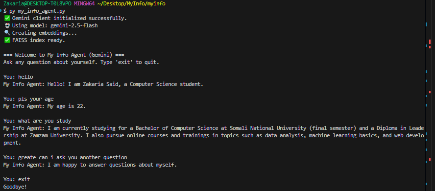

## MyInfo – Personal AI Agent

MyInfo is a small personal AI agent that answers questions about **you**.
It reads your own `.txt` files (education, skills, projects, experience, etc.),
creates vector embeddings with FAISS + SentenceTransformers, and then uses
Google Gemini to generate answers **only from your data**.

You can:
- Chat with your own profile from the terminal (CLI mode).
- Call a simple FastAPI backend from any frontend (web / mobile).

---

## Features

- Loads personal information from the `my_info_data/` folder.
- Creates dense embeddings using `sentence-transformers` and `faiss-cpu`.
- Uses Google Gemini (`google-generativeai`) for natural language answers.
- FastAPI backend with a single `/ask` endpoint.
- Basic conversation history so follow‑up questions feel more natural.
- Special handling for summary questions like "introduce yourself".

---

## Project structure

Key files and folders:

- [api.py](api.py) – FastAPI app that exposes the `/` and `/ask` endpoints.
- [my_info_agent.py](my_info_agent.py) – Core logic: loads documents, builds
  embeddings + FAISS index, calls Gemini, and implements the chat loop.
- [config.py](config.py) – Loads environment variables (e.g. `GOOGLE_API_KEY`).
- [my_info_data/](my_info_data) – Your personal `.txt` files (about, skills,
  education, experience, projects, general responses, etc.).
- [requirements.txt](requirements.txt) – Python dependencies.
- [screenshot/](screenshot) – Contains `test.png` (example screenshot).

Example data files inside `my_info_data/`:

- `about_me.txt` – Short introduction about you.
- `bio.txt` – Short bio / profile.
- `certificates.txt` – Courses, certificates, and trainings.
- `contacts.txt` – Email, GitHub, LinkedIn, etc.
- `education.txt` – Degrees and learning history.
- `experience.txt` – Work, internships, and projects.
- `goals.txt` – Short / mid / long‑term goals.
- `projects.txt` – Your projects with short descriptions.
- `skills.txt` – Technical and soft skills.
- `general.txt` – Greetings, polite responses, and fallback phrases.

---

## Requirements

- Python 3.9+ (recommended)
- A Google Gemini API key

Python packages (from `requirements.txt`):

- `fastapi`
- `uvicorn`
- `pydantic`
- `python-dotenv`
- `faiss-cpu`
- `sentence-transformers`
- `torch`
- `google-generativeai`

Install all with:

```bash
pip install -r requirements.txt
```

---

## Environment variables

Create a `.env` file in the project root (same folder as `api.py`) with:

```env
GOOGLE_API_KEY=your_google_gemini_api_key

# Optional: comma‑separated list of allowed frontends for CORS
FRONTEND_URL=http://localhost:3000,https://your-frontend-domain.com
```

`my_info_agent.py` loads `GOOGLE_API_KEY` from this file and will exit with an
error if it is missing.

---

## How it works

1. **Load documents**  
	All `.txt` files inside `my_info_data/` are read and cleaned.

2. **Create embeddings**  
	`SentenceTransformer("all-MiniLM-L6-v2")` is used to embed each document.

3. **Build FAISS index**  
	The embeddings are L2‑normalized and stored in an `IndexFlatIP` FAISS index
	for similarity search.

4. **Retrieve relevant docs**  
	For each user question, the top‑k most similar documents are retrieved.

5. **Call Gemini**  
	The retrieved documents + conversation history are passed as context to
	Gemini. The model is selected automatically from:
	- `gemini-2.5-flash`
	- `gemini-2.0-flash`
	- `gemini-1.5-flash`

6. **Return answer**  
	The answer is returned either to the CLI or via the FastAPI `/ask` endpoint.

If the requested information is not present in your `.txt` files, the agent is
designed to respond with: `"I don't have that information yet."`

---

## Running the CLI agent

You can chat with your agent directly from the terminal.

```bash
python my_info_agent.py
```

Then type your questions, for example:

- "Introduce yourself"
- "What are your main skills?"
- "List your machine learning projects"
- "What are your short‑term goals?"

Type `exit` or `quit` to close the session.

---

## Running the FastAPI backend

Start the API using `uvicorn`:

```bash
uvicorn api:app --reload
```

By default this runs at `http://127.0.0.1:8000`.

### Health check

```bash
curl http://127.0.0.1:8000/
```

Example response:

```json
{"status": "My Info Agent API is running"}
```

### Ask a question (POST /ask)

Endpoint: `POST /ask`

Request body:

```json
{
  "question": "What are your main projects?"
}
```

Example `curl` call:

```bash
curl -X POST "http://127.0.0.1:8000/ask" \
  -H "Content-Type: application/json" \
  -d '{"question": "Summarize your background"}'
```

Response body:

```json
{
  "answer": "...generated answer based on your my_info_data files..."
}
```

You can connect this endpoint to any frontend (for example, your MyTwins web
app) by configuring `FRONTEND_URL` properly.

---

## Customizing your data

To make the agent truly personal, edit the `.txt` files in
`my_info_data/` with your own content. For example:

- Update `about_me.txt` with your introduction.
- Refine `skills.txt` with your latest tech stack.
- Add new projects to `projects.txt`.
- Expand `goals.txt` as your plans change.
- Tune `general.txt` to control greetings and fallback messages.

After editing these files, simply restart the CLI or API process so the
embeddings and FAISS index are rebuilt.

---

## Screenshot

If you keep the existing screenshot, you can reference it like this in your
frontend or in documentation:

<p align="center">
  
</p>
